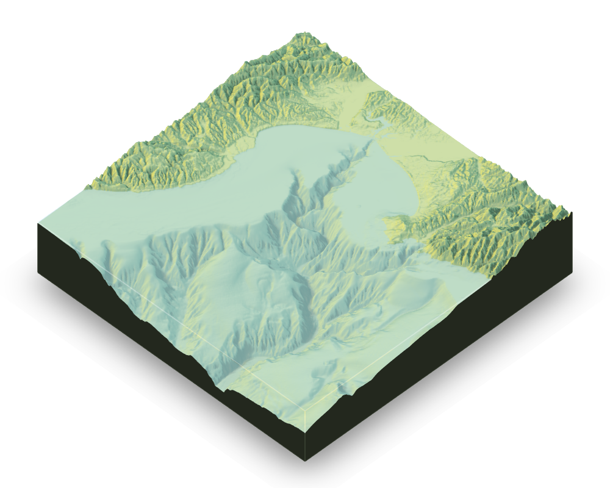
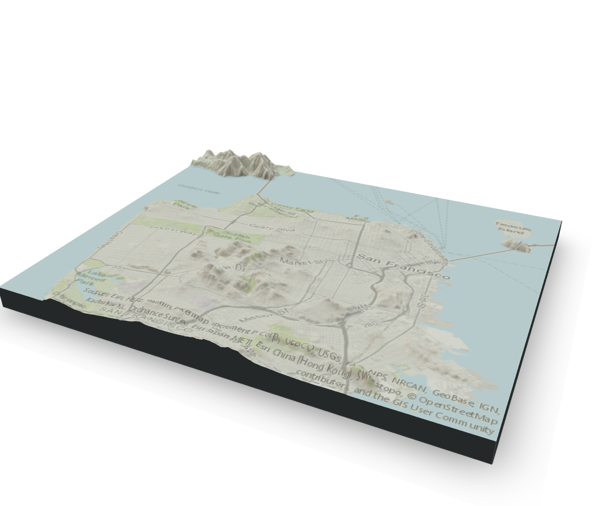
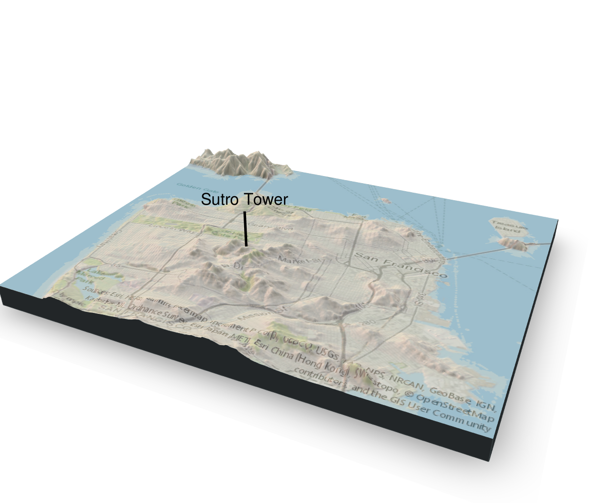
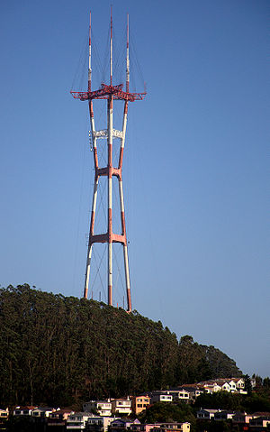
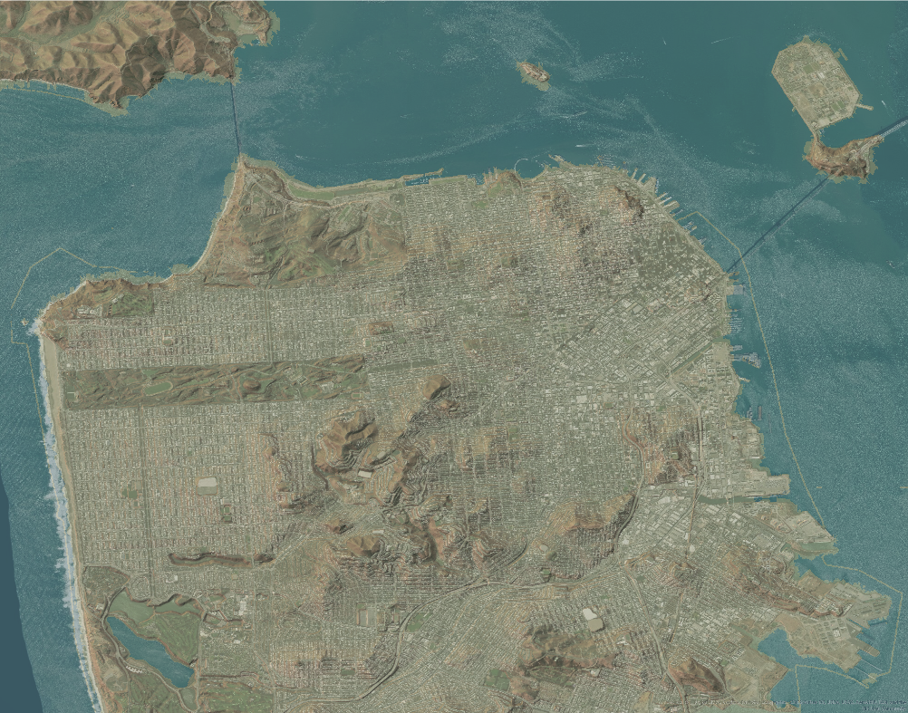
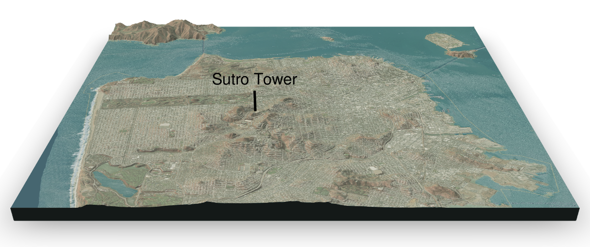

```{r setup, include=FALSE}
knitr::opts_chunk$set(echo = TRUE, message = FALSE, warning = FALSE)

library(httr)
library(glue)
library(jsonlite)
library(raster)
library(rayshader)

source(file.path("R", "map-image-api.R"))
source(file.path("R", "elevation-api.R"))
source(file.path("R", "image-size.R"))
source(file.path("R", "rayshader-gif.R"))
source(file.path("R", "read-elevation.R"))
source(file.path("R", "find-image-coordinates.R"))

elev_file <- "data/sf-elevation.tif"
overlay_file <- "images/sf-map.png"
overlay_img <- png::readPNG(overlay_file)
```

# Introduction

Last month in January, I attended the wonderful [rstudio::conf 2019](https://www.rstudio.com/conference/) in Austin, TX. One of the most interesting (and entertaining) presentations I saw at the conference was by [Tyler Morgan-Wall](https://twitter.com/tylermorganwall), talking about his magical `rayshader` package^[You can watch Tyler Morgan-Wall's full rstudio::conf 2019 presentation [online here](https://resources.rstudio.com/rstudio-conf-2019/3d-mapping-plotting-and-printing-with-rayshader)]. From Tyler's [rayshader website](https://www.rayshader.com):

<aside>
```{r, echo=FALSE}
knitr::include_graphics("images/raylogosmall.png")
```
</aside>

> rayshader is an open source R package for producing 2D and 3D hillshaded maps of elevation matrices using a combination of raytracing, spherical texture mapping, overlays, and ambient occlusion.

Basically, `rayshader` makes maps -- *beautiful* 2D and 3D maps, built from raw elevation data. Like this one of Monterey Bay in California, using the code below:

```{r monterey-example, eval=FALSE}
library(rayshader)

montereybay %>%
  sphere_shade(zscale = 10, texture = "imhof1") %>%
  add_shadow(ray_shade(montereybay, zscale = 50)) %>%
  add_shadow(ambient_shade(montereybay, zscale = 50)) %>%
  plot_3d(montereybay, zscale = 50, theta = -45, phi = 45, water = TRUE,
          windowsize = c(1000,800), zoom = 0.75, waterlinealpha = 0.3,
          wateralpha = 0.5, watercolor = "lightblue", waterlinecolor = "white")
render_snapshot()
```

```{r monterey-example-view, echo=FALSE}

```

I had seen images from `rayshader` floating around on Twitter, but it was amazing to get a (meme-filled) tour of the features from the package creator. I was inspired to try it out! I got up and running quickly with the package documentation, and I was spinning 3D plots of the included `montereybay` dataset in no time. But then I was stuck. How do I make my *own* maps? How do I add those nice image overlays? And how do I make those amazing gifs?! 

You see, I'm an "uneducated" `rayshader` user -- I don't know much about maps. Where do I get elevation data? What the heck is a `.tif`? Where can I download map images? How does one *simply* gif? The `rayshader` package falls on the right side of "magic" for the most part, but I found the documentation for these sorts of beginner questions lacking. So after stumbling through the darkness for a while and learning some things, I wrote this article for users like me, to help answer those questions. The message is this: **I can rayshade, and so can you**!^[Spoiler, I still don't know what a .tif is, but I'm still putting them to good use now.]

### Setup 

For this article, I'm using the latest dev version of `rayshader` from GitHub (version `r packageVersion("rayshader")` at the time of writing), which is significantly faster than the version I had installed from CRAN. You can download this version with the code below. Many of the code-snippets in this article also use custom functions I wrote for this post. You will need to source these functions locally to use them. All these functions are available in the [git source repo](https://github.com/wcmbishop/rayshader-demo) for this article, under the `R` folder, along with a single file with all the code samples from this post in `code-samples.R`.^[You can find the source code for this article, including all custom R functions (under the `R` folder), in the [git repo here](https://github.com/wcmbishop/rayshader-demo).] Now...let's get mapping.

<aside>
Note: custom functions are marked with *⎈local* -- e.g. `foo()`<sub>*⎈local*</sub>. You will need to source these locally to use them.
</aside>


```{r}
# To install the latest version from Github:
# install.packages("devtools")
devtools::install_github("tylermorganwall/rayshader")
```

# Selecting a Region

The first step in making My Own Map™ is to pick out a region. To keep it simple, let's stick with just a plain rectangular "bounding box" of somewhere in the world. I live in the Bay Area, so I thought I'd try out San Francisco to start with (plus, that's where rstudio::conf 2020 will be hosted!). Originally, I wanted to have a nice UI to manually draw a region on an interactive map...but that seemed hard. Instead, I settled on manually iterating on a set of longitude/latitude coordinates and displaying them in a map using the [`leaflet`](https://rstudio.github.io/leaflet/) package. The code and map below shows my selected bounding box for San Francisco.  

```{r leaflet-map}
library(leaflet)

# define bounding box with longitude/latitude coordinates
bbox <- list(
  p1 = list(long = -122.522, lat = 37.707),
  p2 = list(long = -122.354, lat = 37.84)
)

leaflet() %>%
  addTiles() %>% 
  addRectangles(
    lng1 = bbox$p1$long, lat1 = bbox$p1$lat,
    lng2 = bbox$p2$long, lat2 = bbox$p2$lat,
    fillColor = "transparent"
  ) %>%
  fitBounds(
    lng1 = bbox$p1$long, lat1 = bbox$p1$lat,
    lng2 = bbox$p2$long, lat2 = bbox$p2$lat,
  )
```

### Setting the Image Size

Next is a small but important step. We need to define an **image size** to use based on our selected bounding box coordinates. Both our elevation data and our map overlay will be downloaded as image files (I think the term "image" file either means more than I know about, or it plays double-duty for data encoding with this spatial data). For our `rayshader` maps to work, two things are required:

1. the image dimensions need to match our bounding box coordinates (i.e have the same aspect ratio)
2. the image dimensions of the elevation data and the map overlay need to match exactly (i.e. produce the same size arrays)

The custom function [`define_image_size()`](https://github.com/wcmbishop/rayshader-demo/blob/master/R/image-size.R)<sub>*⎈local*</sub>  below calculates an image size to use in the rest of our code, with the results shown in json. We can set the overall size of the image by defining the major dimension (e.g. `600` pixels, which sets the larger image dimension). Larger sizes will download more elevation data and make more detailed maps.

```{r image_size}
image_size <- define_image_size(bbox, major_dim = 600)
```

```{r, echo=FALSE}
jsonlite::toJSON(image_size, auto_unbox = TRUE, pretty = TRUE)
```

# Downloading Elevation Data

Next we need to download some elevation data for our selected map region. This was probably the most difficult and intimidating part of this whole effort. As a person who is new to maps and layers and GIS and such, I had no idea where to start (and this field is *deep*). There are probably numerous great options out there^[Two seemingly nice paid mapping tools, with some level of free content, are [MapBox](https://www.mapbox.com) and [Planet](https://www.planet.com)], but I generally found them either confusing or costly. 

I wanted something **free** and **programmatic**. And the good news is, if you are looking for map regions in North America, there is an API for you! The USGS hosts a National Map tool that can export elevation data via a [web UI here](https://elevation.nationalmap.gov/arcgis/rest/services/3DEPElevation/ImageServer/exportImage?bbox=-122.522%2C37.707%2C-122.354%2C37.84&bboxSR=4326&size=600%2C480&imageSR=4326&time=&format=jpgpng&pixelType=F32&noData=&noDataInterpretation=esriNoDataMatchAny&interpolation=+RSP_BilinearInterpolation&compression=&compressionQuality=&bandIds=&mosaicRule=&renderingRule=&f=html), and they also support a REST API for the same data^[You can find the USGS elevation data online [here](https://elevation.nationalmap.gov/arcgis/rest/services/3DEPElevation/ImageServer/exportImage), and there is good documentation on the ArcGIS REST API [here](https://developers.arcgis.com/rest/services-reference/export-image.htm)]. (If folks know of good resources for elevation data beyond North America, I'd love to know -- please create an [issue here](https://github.com/wcmbishop/rayshader-demo/issues/new) with details.)

I wrote the function [`get_usgs_elevation_data()`](https://github.com/wcmbishop/rayshader-demo/blob/master/R/elevation-api.R)<sub>*⎈local*</sub> to download elevation data using this API. The code below makes the process look easy! Now we have elevation measurements for our selected region (using our defined image size) in a .tif file, ready to raster (...whatever that means).

```{r elevation-api, eval=FALSE}
# download elevation data
elev_file <- file.path("data", "sf-elevation.tif")
get_usgs_elevation_data(bbox, size = image_size$size, file = elev_file,
                        sr_bbox = 4326, sr_image = 4326)
```

### SR: Spatial Reference

Before I move on, let's take a moment to talk about coordinate systems. You may have noticed the two numeric inputs above for `sr_bbox` and `sr_image`. The "sr" refers to "spatial reference". Apparently a map is not a map is not a map -- how it's drawn and what measurements it uses depend on its spatial reference system, each identified by an SR code. You can read a great introduction on this topic  [here](https://developers.arcgis.com/documentation/core-concepts/spatial-references/)^[Read about Spatial Reference systems for mapping on the ArcGIS website [here](https://developers.arcgis.com/documentation/core-concepts/spatial-references/)]. For this article, I'm using SR 4326, which is the common GPS coordinate system, where positions are defined in *degrees* of longitude/latitude (as opposed to say the non-spherical mercator projections of SR 3857 used by `leaflet` and other web mapping packages).

### Plotting *My Own Map™*

Now with this downloaded elevation data, I can make my very own map. In the code below, I first read in the elevation `.tif` file and load it into a 2D elevation matrix -- I show the code here for clarity, but this common step can be encapsulated in a function to make this a one-line call (which I've done in [`read_elevation_file()`](https://github.com/wcmbishop/rayshader-demo/blob/master/R/read-elevation.R)<sub>*⎈local*</sub>). Next is typical `rayshader` code -- I calculate some data layers and then build a 2D plot. I chose to calculate the initial data layers outside of the plot pipeline because I will re-use those pre-calculated layers in subsequent plots. 

```{r load-elevation, results=FALSE}
# load elevation data
elev_img <- raster::raster(elev_file)
elev_matrix <- matrix(
  raster::extract(elev_img, raster::extent(elev_img), buffer = 1000), 
  nrow = ncol(elev_img), ncol = nrow(elev_img)
)

# calculate rayshader layers
ambmat <- ambient_shade(elev_matrix, zscale = 30)
raymat <- ray_shade(elev_matrix, zscale = 30, lambert = TRUE)
watermap <- detect_water(elev_matrix)

# plot 2D
elev_matrix %>%
  sphere_shade(texture = "imhof4") %>%
  add_water(watermap, color = "imhof4") %>%
  add_shadow(raymat, max_darken = 0.5) %>%
  add_shadow(ambmat, max_darken = 0.5) %>%
  plot_map()
```


# Overlaying Map Images

Beautiful! San Francisco: the hilly, desert city by the bay. The vanilla `rayshader` plots can look striking, but sometimes they appear a bit barren. They are also missing context -- e.g. which one of those nobby hills is Nob Hill? Wouldn't it be nice to have a map overlayed on top to get our bearings? Or maybe a satellite image? That's possible with the `rayshader` `add_overlay()` function, but the *hard* part is getting the image. We need an image for the same bounding box region, AND (as mentioned above) the overlay image dimensions need to match our elevation data dimensions exactly. 

Good news! Once again, there's an API for that. ArcGISOnline hosts a web UI for exporting map images  [here](https://utility.arcgisonline.com/arcgis/rest/services/Utilities/PrintingTools/GPServer/Export%20Web%20Map%20Task/execute), and this same url can also be accessed programmatically as a REST API.^[You can generate map images at arcgisonline.com via a web UI  [here](https://utility.arcgisonline.com/arcgis/rest/services/Utilities/PrintingTools/GPServer/Export%20Web%20Map%20Task/execute), and there is good documentation on this ArcGIS REST API endpoint [here](https://developers.arcgis.com/rest/services-reference/export-web-map-task.htm).]

I wrote the function [`get_arcgis_map_image()`](https://github.com/wcmbishop/rayshader-demo/blob/master/R/map-image-api.R)<sub>*⎈local*</sub> to interface with this API endpoint (which is actually a two-step process: one call to generate an image, another call to download the image). Once again, the code below makes this step look easy. You can see the downloaded map image to the right of the code.

```{r map-image-api, eval=FALSE}
# fetch overlay image
overlay_file <- "images/sf-map.png"
get_arcgis_map_image(bbox, map_type = "World_Topo_Map", file = overlay_file,
                     width = image_size$width, height = image_size$height, 
                     sr_bbox = 4326)
overlay_img <- png::readPNG(overlay_file)
```

<aside>
```{r echo=FALSE}
knitr::include_graphics(overlay_file)
```
</aside>

There are several base map types to choose from in the API, which are [listed here](https://services.arcgisonline.com/ArcGIS/rest/services) under "Services". Below are three options I enjoy. 

```{r map-types, fig.width=7, fig.height=2, echo=FALSE, layout="l-body-outset"}
library(ggplot2)
library(patchwork)
img_street <- png::readPNG(file.path("images", "sf-street.png"))
img_topo <- png::readPNG(file.path("images", "sf-topo.png"))
img_sat <- png::readPNG(file.path("images", "sf-satellite.png"))
# build plots
theme_size <- 6
gg_street <- ggplot() + theme_minimal(theme_size) +
  annotation_custom(grid::rasterGrob(img_street, interpolate = TRUE), 
                    xmin = -Inf, xmax = Inf, ymin = -Inf, ymax = Inf) +
  ggtitle("World_Street_Map")
gg_topo <- ggplot() + theme_minimal(theme_size) +
  annotation_custom(grid::rasterGrob(img_topo, interpolate = TRUE), 
                    xmin = -Inf, xmax = Inf, ymin = -Inf, ymax = Inf) +
  ggtitle("World_Topo_Map")
gg_sat <- ggplot() + theme_minimal(theme_size) +
  annotation_custom(grid::rasterGrob(img_sat, interpolate = TRUE), 
                    xmin = -Inf, xmax = Inf, ymin = -Inf, ymax = Inf) +
  ggtitle("World_Imagery")
# patchwork
gg_street + gg_topo + gg_sat
```

### 2D Map Overlays

Now that we have a map overlay image (with matching dimensions), We can add that to our `rayshader` plots. Here is a 2D overlay plot - the new layer `add_overlay()` adds the downloaded map image to the rendered `rayshader` plot.

```{r rayshader-2D-overlay, results=FALSE}
# 2D plot with map overlay
elev_matrix %>%
  sphere_shade(texture = "imhof4") %>%
  add_water(watermap, color = "imhof4") %>%
  add_shadow(raymat, max_darken = 0.5) %>%
  add_shadow(ambmat, max_darken = 0.5) %>%
  add_overlay(overlay_img, alphalayer = 0.5) %>%
  plot_map()
```

### 3D Map Overlays

And we can do the same thing with a 3D `rayshader` plot. Below is a static rendered snapshot, but locally you can interact with the 3D plot and manually spin and zoom to your heart's content.

```{r rayshader-3D-overlay, eval=FALSE}
zscale <- 10
rgl::clear3d()
elev_matrix %>% 
  sphere_shade(texture = "imhof4") %>% 
  add_water(watermap, color = "imhof4") %>%
  add_overlay(overlay_img, alphalayer = 0.5) %>%
  add_shadow(raymat, max_darken = 0.5) %>%
  add_shadow(ambmat, max_darken = 0.5) %>%
  plot_3d(elev_matrix, zscale = zscale, windowsize = c(1200, 1000),
          water = TRUE, soliddepth = -max(elev_matrix)/zscale, wateralpha = 0,
          theta = 25, phi = 30, zoom = 0.65, fov = 60)
render_snapshot()
```
```{r rayshader-3D-overlay-show, echo=FALSE}

```

We can even add map labels to our 3D plot with `render_label()`. Here's a marker for Sutro Tower, added after looking up the GPS coordinates on [latlong.net](https://www.latlong.net). I use the custom function [`find_image_coordinates()`](https://github.com/wcmbishop/rayshader-demo/blob/master/R/find-image-coordinates.R)<sub>*⎈local*</sub> to translate the GPS coordinates into an image x/y position.

```{r rayshader-3D-overlay-label, eval=FALSE, results=FALSE}
# define label
label <- list(text = "Sutro Tower")
label$pos <- find_image_coordinates(
  long = -122.452131, lat = 37.756735, bbox = bbox,
  image_width = image_size$width, image_height = image_size$height)

# plot 3D
zscale <- 10
rgl::clear3d()
elev_matrix %>% 
  sphere_shade(texture = "imhof4") %>% 
  add_water(watermap, color = "imhof4") %>%
  add_overlay(overlay_img, alphalayer = 0.5) %>%
  add_shadow(raymat, max_darken = 0.5) %>%
  add_shadow(ambmat, max_darken = 0.5) %>%
  plot_3d(elev_matrix, zscale = zscale, windowsize = c(1200, 1000),
          water = TRUE, soliddepth = -max(elev_matrix)/zscale, wateralpha = 0,
          theta = 25, phi = 30, zoom = 0.65, fov = 60)
# add label
render_label(elev_matrix, x = label$pos$x, y = label$pos$y, z = 500, 
             zscale = zscale, text = label$text, textsize = 2, linewidth = 5)
render_snapshot()
```

```{r rayshader-3D-overlay-label-show, echo=FALSE}

```

<aside>
```{r, echo=FALSE, fig.cap="Sutro Tower, by Justin Beck [CC BY 2.0](https://creativecommons.org/licenses/by/2.0), via Wikimedia Commons"}

```
</aside>


# Into the 4th Dimension - GIFs

Of course, one of the most eye-popping features of `rayshader` is the gifs it can make. We loved going from 2D to 3D, so why not animate? *People. Love. GIFs.* So, let's make some!

```{r, echo=FALSE, fig.align="center"}

```

Again this is possible, but I found the documentation on this a bit lacking. 
A good example can be found in [this blog post](https://www.tylermw.com/3d-maps-with-rayshader/) from Tyler Morgan-Wall's website -- the code below is pulled from that post. Basically, we loop through multiple plots to save individual images with `render_snapshot()`, then we stitch them into a gif with `image_write_gif()` (from the [`magick`](https://github.com/ropensci/magick) package). The code is readable and not *too* long....but what what if there was a *simpler* way?

<aside>
```{r, echo=FALSE}
knitr::include_graphics("images/montereybay.gif")
```
</aside>

```{r 3D-gif-basic, eval=FALSE}
# montery water gif ====
elev_matrix <- montereybay
n_frames <- 180
zscale <- 50
# frame transition variables
waterdepthvalues <- min(elev_matrix)/2 - min(elev_matrix)/2 * cos(seq(0,2*pi,length.out = n_frames))
thetavalues <- -90 + 45 * cos(seq(0, 2*pi, length.out = n_frames))
# shadow layers
ambmat <- ambient_shade(elev_matrix, zscale = zscale)
raymat <- ray_shade(elev_matrix, zscale = zscale, lambert = TRUE)

# generate .png frame images
img_frames <- paste0("drain", seq_len(n_frames), ".png")
for (i in seq_len(frames)) {
  message(paste(" - image", i, "of", n_frames))
  elev_matrix %>%
    sphere_shade(texture = "imhof1") %>%
    add_shadow(ambmat, 0.5) %>%
    add_shadow(raymat, 0.5) %>%
    plot_3d(elev_matrix, solid = TRUE, shadow = TRUE, zscale = zscale, 
            water = TRUE, watercolor = "imhof3", wateralpha = 0.8, 
            waterlinecolor = "#ffffff", waterlinealpha = 0.5,
            waterdepth = waterdepthvalues[i]/zscale, 
            theta = thetavalues[i], phi = 45)
  render_snapshot(img_frames[i])
  rgl::clear3d()
}

# build gif
magick::image_write_gif(magick::image_read(img_frames), 
                        path = "montereybay.gif", 
                        delay = 6/n_frames)
```

### One can *simply* gif

But wait! There's a simpler way to gif, using the custom function [`save_3d_gif()`](https://github.com/wcmbishop/rayshader-demo/blob/master/R/rayshader-gif.R)<sub>*⎈local*</sub>. You can pipe in plot layers to this function just like you would with `rayshader::plot_3d()`, with the addition of two new inputs: `file` (your gif file-path) and `duration` (your gif duration). But unlike `plot_3d()`, you can pass in any regular input as a vector (e.g. a bunch of `theta` values to generate a rotating gif). Any vector inputs with lengths >1 will be used to programatically generate intermediate .png images and then create a gif from these. This function is basically generating the same code as shown above, but it's dynamically made using [tidy evaluation](https://tidyeval.tidyverse.org). The result is the same (e.g. a beautiful gif of Monterey Bay, spinning and draining the water level), but the code is half as long and (hopefully) more readable. This includes using the helper function [`transition_values()`](https://github.com/wcmbishop/rayshader-demo/blob/master/R/rayshader-gif.R)<sub>*⎈local*</sub> to create gif input vectors for the animation frames.

```{r 3D-gif-better, eval=FALSE}
# calculate input vectors for gif frames
n_frames <- 180
waterdepths <- transition_values(from = 0, to = min(montereybay), steps = n_frames) 
thetas <- transition_values(from = -45, to = -135, steps = n_frames)
# generate gif
zscale <- 50
montereybay %>% 
  sphere_shade(texture = "imhof1", zscale = zscale) %>%
  add_shadow(ambient_shade(montereybay, zscale = zscale), 0.5) %>%
  add_shadow(ray_shade(montereybay, zscale = zscale, lambert = TRUE), 0.5) %>%
  save_3d_gif(montereybay, file = "montereybay.gif", duration = 6,
              solid = TRUE, shadow = TRUE, water = TRUE, zscale = zscale,
              watercolor = "imhof3", wateralpha = 0.8, 
              waterlinecolor = "#ffffff", waterlinealpha = 0.5,
              waterdepth = waterdepths/zscale, 
              theta = thetas, phi = 45)
```

```{r, echo=FALSE}
knitr::include_graphics("images/montereybay.gif")
```

Here's another example, a gratuitous use of angles and zoom to build a San Francisco fly-by.

```{r, sf-flyby-gif, eval=FALSE}
# gif transition variables
n_frames <- 180
theta <- transition_values(from = 0, to = 360, steps = n_frames, 
                           one_way = TRUE, type = "lin")
phi <- transition_values(from = 10, to = 70, steps = n_frames, 
                         one_way = FALSE, type = "cos")
zoom <- transition_values(from = 0.4, to = 0.8, steps = n_frames, 
                         one_way = FALSE, type = "cos")

# GIF it!
zscale <- 10
elev_matrix %>% 
  sphere_shade(texture = "imhof4") %>% 
  add_water(watermap, color = "imhof4") %>%
  add_overlay(overlay_img, alphalayer = 0.5) %>%
  add_shadow(raymat, 0.4) %>%
  add_shadow(ambmat, 0.4) %>%
  save_3d_gif(elev_matrix, file = "images/sf-flyby.gif", duration = 6,
              zscale = zscale, windowsize = c(1200, 1000), wateralpha = 0,
              water = TRUE, soliddepth = -max(elev_matrix)/zscale, 
              theta = theta, phi = phi, zoom = zoom, fov = 60)
```

```{r, echo=FALSE}
knitr::include_graphics("images/sf-flyby.gif")
```

# Big Maps

For size and speed reasons while creating this article, I've been using an image size of 600 (on the major dimension). But if you increase that, you cake make some incredibly detailed maps. Here's what our San Francisco map looks like at a size of 2000, using the "World_Imagery" satellite map overlay. Stunning.

**2D Big San Francisco**

```{r, echo=FALSE, layout="l-body-outset"}

```

**3D Big San Francisco**

```{r, echo=FALSE, layout="l-body-outset"}

```

# Conclusion

That's all I've got. I hope you learned something that may save you a bit of pain and confusion if you try out `rayshader` for yourself. And maybe you're coming away with just a bit more excitement and inspiration to do so. I've certainly enjoyed my time with this package, and I'll be making more maps in the future (as well as 3D printing some of them!). 

If you have suggestions or edits or thoughts on this material, please feel free to [create an issue](https://www.github.com/wcmbishop/rayshader-demo/issues/new) in the git repo or tweet at me at [wcmbishop](https://twitter.com/wcmbishop).

Thanks for reading. 


# Afterthoughts

After writing this post, I found a few more leads on elevation data sources. I thought I'd share these here (though I think the REST API option I described above is still a great starting place).

One is the `elevatr` R package ([vignette here](https://cran.r-project.org/web/packages/elevatr/vignettes/introduction_to_elevatr.html#usgs_elevation_point_query_service)), which uses the National Map [Elevation Point Query Service](http://ned.usgs.gov/epqs/).

Tyler Morgan-Wall also posted some instructions for manually downloading elevation data from a National Map UI [here](https://viewer.nationalmap.gov/basic/?basemap=b1&category=ned,nedsrc&title=3DEP%20View) -- the instructions from this [reddit post](https://www.reddit.com/r/dataisbeautiful/comments/950vzg/visualizing_3d_maps_with_r_what_it_looks_like/) are quoted below:

> Select File Format: IMG, and then zoom into where you want data. Click the big blue FIND PRODUCTS button at the top. In the Elevation Products (3DEP) pane, click the "results" link to expand the available topographic data available. Then click "Show Footprints" to show the areas that have data, and just hover over the area you want. It should give you a name like "n39w077"--find that in the results pane, and then click the download button. You should download a zip of an IMG file that should contain your data.  
> Then just load your data locally with the raster package:
> ```
data = raster::raster("sampledata.img")
ready_to_use_data = matrix(
  raster::extract(data,
  raster::extent(data), buffer=10000), nrow=ncol(data), ncol=nrow(data)
)
```

# Acknowledgments {.appendix}

This article was built with [Radix](https://rstudio.github.io/radix) - thanks [RStudio](https://www.rstudio.com)!.

And thanks for Tyler Morgan-Wall for creating the joyous [`rayshader`](https://www.rayshader.com) package. 

