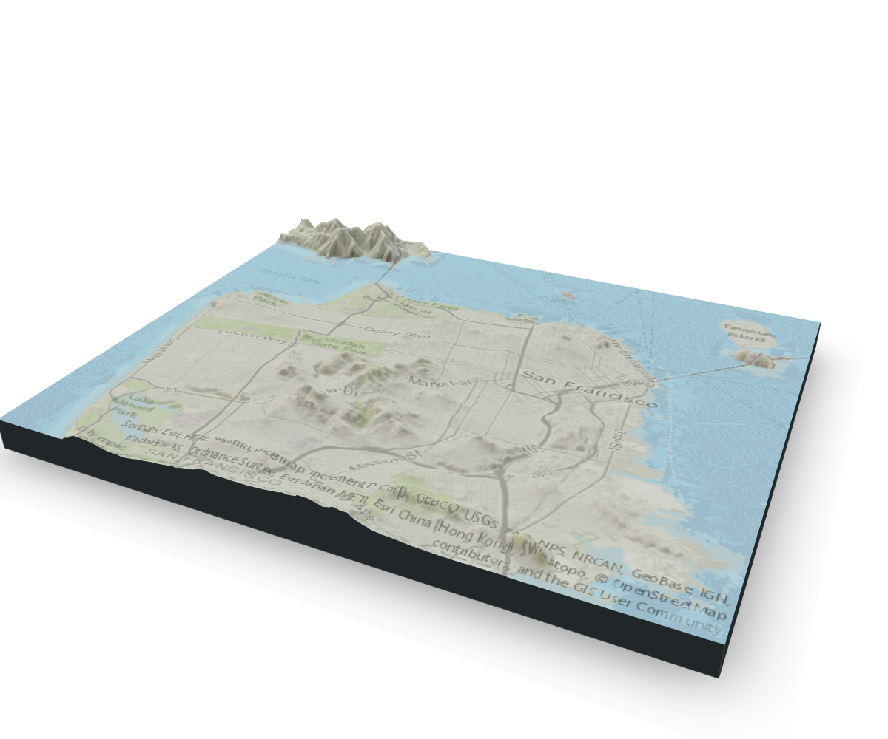

```{r setup, include=FALSE}
# BUILD: rmarkdown::render('rayshader-demo.Rmd', output_file = 'index.html')
knitr::opts_chunk$set(echo = TRUE)

library(httr)
library(glue)
library(jsonlite)
library(raster)
library(rayshader)

source(file.path("R", "map-image-api.R"))
source(file.path("R", "elevation-api.R"))
source(file.path("R", "image-size.R"))
source(file.path("R", "rayshader-gif.R"))
source(file.path("R", "read-elevation.R"))

elev_file <- "data/sf-elevation.tif"
overlay_file <- "images/sf-map.png"
overlay_img <- png::readPNG(overlay_file)
```

# Introduction 

Hello! Here are a bunch of words...

<aside>
```{r, echo=FALSE, fig.cap="From [rayshader.com](https://www.rayshader.com)"}
knitr::include_graphics("images/raylogosmall.png")
```
</aside>

Install the dev version of [`rayshader`](https://www.rayshader.com) for speed.

```{r}
# install.packages("devtools")
devtools::install_github("tylermorganwall/rayshader")
```


We can do cool stuff like this. But how do we do it for our own maps?!?!

```{r monterey-example, eval=FALSE}
library(rayshader)

montereybay %>%
  sphere_shade(zscale = 10, texture = "imhof1") %>%
  add_shadow(ray_shade(montereybay, zscale = 50, lambert = FALSE), 0.5) %>%
  add_shadow(ambient_shade(montereybay, zscale = 50), 0.5) %>%
  plot_3d(montereybay, zscale = 50, theta = -45, phi = 45, water = TRUE,
          windowsize = c(1000,800), zoom = 0.75, waterlinealpha = 0.3,
          wateralpha = 0.5, watercolor = "lightblue", waterlinecolor = "white")
render_snapshot()
```

```{r monterey-example-view, echo=FALSE}
knitr::include_graphics("images/monetereybay-3D.png")
```

# Selecting a Region

First we need to pic a map region. 

```{r leaflet-map}
library(leaflet)

# define bounding box with longitude/latitude coordinates
bbox <- list(
  p1 = list(long = -122.522, lat = 37.707),
  p2 = list(long = -122.354, lat = 37.84) #37.84, 37.817
)

leaflet() %>%
  addTiles() %>% 
  addRectangles(
    lng1 = bbox$p1$long, lat1 = bbox$p1$lat,
    lng2 = bbox$p2$long, lat2 = bbox$p2$lat,
    fillColor = "transparent"
  ) %>%
  fitBounds(
    lng1 = bbox$p1$long, lat1 = bbox$p1$lat,
    lng2 = bbox$p2$long, lat2 = bbox$p2$lat,
  )
```


Define the image size based on our bounding box coordinates above.

```{r image_size}
image_size <- define_image_size(bbox, major_dim = 600)
```

```{r, echo=FALSE}
jsonlite::toJSON(image_size, auto_unbox = T, pretty = T)
```

# Downloading Elevation Data

Download some elevation data! Talk about Spatial Reference codes here...

```{r elevation-api, message=FALSE, eval=FALSE}
# download elevation data
elev_file <- file.path("data", "sf-elevation.tif")
get_elevation_data(bbox, size = image_size$size, file = elev_file,
                   sr_bbox = 4326, sr_image = 4326)
```

Render a 2D map from our `.tif` elevation file!

```{r load-elevation, results=FALSE}
# load elevation data
elev_img <- raster::raster(elev_file)
elev_matrix <- matrix(
  raster::extract(elev_img, raster::extent(elev_img), buffer = 1000), 
  nrow = ncol(elev_img), ncol = nrow(elev_img)
)

# calculate rayshader layers
ambmat <- ambient_shade(elev_matrix, zscale = 30)
raymat <- ray_shade(elev_matrix, zscale = 30, lambert = TRUE)
watermap <- detect_water(elev_matrix)
```

```{r 2D-map, message=FALSE, warning=FALSE}
# plot 2D
elev_matrix %>%
  sphere_shade(texture = "imhof4", sunangle = 315) %>%
  add_water(watermap, color = "imhof4") %>%
  add_shadow(raymat, 0.5) %>%
  add_shadow(ambmat, 0.5) %>%
  plot_map()
```

# Overlaying Map Images

Wouldn't this look nice with an overlay?
```{r map-image-api, message=FALSE, eval=FALSE}
# fetch overlay image
overlay_file <- "images/sf-map.png"
get_map_image(bbox, map_type = "World_Topo_Map", file = overlay_file,
              width = image_size$width, height = image_size$height, 
              sr_bbox = 4326)
overlay_img <- png::readPNG(overlay_file)
```

<aside>
```{r echo=FALSE, fig.cap="API generated map image!"}
knitr::include_graphics(overlay_file)
```
</aside>

There are several base map types to choose from in the API, which are [listed here](https://services.arcgisonline.com/ArcGIS/rest/services) under "Services". Below are three nice options. 

```{r, fig.width=7, fig.height=2, echo=FALSE}
library(ggplot2)
library(patchwork)
img_street <- png::readPNG(file.path("images", "sf-street.png"))
img_topo <- png::readPNG(file.path("images", "sf-topo.png"))
img_sat <- png::readPNG(file.path("images", "sf-satellite.png"))
# build plots
theme_size <- 10
gg_street <- ggplot() + theme_minimal(theme_size) +
  annotation_custom(grid::rasterGrob(img_street, interpolate = TRUE), 
                    xmin = -Inf, xmax = Inf, ymin = -Inf, ymax = Inf) +
  ggtitle("World_Street_Map")
gg_topo <- ggplot() + theme_minimal(theme_size) +
  annotation_custom(grid::rasterGrob(img_topo, interpolate = TRUE), 
                    xmin = -Inf, xmax = Inf, ymin = -Inf, ymax = Inf) +
  ggtitle("World_Topo_Map")
gg_sat <- ggplot() + theme_minimal(theme_size) +
  annotation_custom(grid::rasterGrob(img_sat, interpolate = TRUE), 
                    xmin = -Inf, xmax = Inf, ymin = -Inf, ymax = Inf) +
  ggtitle("World_Imagery")
# patchwork
gg_street + gg_topo + gg_sat
```

## 2D Map Overlays

Now that we have our map overlay image (with matching dimensions!), we can add that to our `rayshader` plots. Here's a 2D overlay plot - the new layer `add_overlay` adds our downloaded map image to the render `rayshader` plot.

```{r rayshader-2D-overlay, results="hold"}
# 2D plot with map overlay
palette <- "imhof4"
elev_matrix %>%
  sphere_shade(texture = palette, sunangle = 315) %>%
  add_water(watermap, color = palette) %>%
  add_shadow(raymat, 0.5) %>%
  add_shadow(ambmat, 0.5) %>%
  add_overlay(overlay_img, alphalayer = 0.5) %>%
  plot_map()
```

## 3D Map Overlays

And we can do the same thing with a 3D `rayshader` plot. Below is a static rendered snapshot, but on your machine you can interact with the 3D plot and manual spin and zoom to your heart's content.

```{r rayshader-3D-overlay, eval=FALSE}
zscale <- 10
palette <- "imhof4"
rgl::clear3d()
elev_matrix %>% 
  sphere_shade(zscale = zscale, texture = palette) %>% 
  add_water(watermap, color = palette) %>%
  add_overlay(overlay_img, alphalayer = 0.5) %>%
  add_shadow(raymat, 0.4) %>%
  add_shadow(ambmat, 0.4) %>%
  plot_3d(elev_matrix, zscale = zscale, windowsize = c(1200, 1000),
          water = TRUE, soliddepth = -max(elev_matrix)/zscale,
          theta = 25, phi = 30, zoom = 0.65, fov = 60)
render_snapshot()
```
```{r echo=FALSE}

```


# 4D? Making 3D GIFs

We can even build a snazy gif that makes `rayshader` really pop.

```{r 3D-gif-basic, eval=FALSE}
# montery water gif ====
elev_matrix <- montereybay
n_frames <- 180
zscale <- 50
# frame transition variables
waterdepthvalues <- min(elev_matrix)/2 - min(elev_matrix)/2 * cos(seq(0,2*pi,length.out = n_frames))
thetavalues <- -90 + 45 * cos(seq(0, 2*pi, length.out = n_frames))
# shadow layers
ambmat <- ambient_shade(elev_matrix, zscale = zscale)
raymat <- ray_shade(elev_matrix, zscale = zscale, lambert = TRUE)

# generate .png frame images
img_frames <- paste0("drain", seq_len(n_frames), ".png")
for (i in seq_len(frames)) {
  message(paste(" - image", i, "of", n_frames))
  elev_matrix %>%
    sphere_shade(texture = "imhof1", zscale = 10) %>%
    add_shadow(ambmat, 0.5) %>%
    add_shadow(raymat, 0.5) %>%
    plot_3d(elev_matrix, solid = TRUE, shadow = TRUE, zscale = zscale, 
            water = TRUE, watercolor = "imhof3", wateralpha = 0.8, 
            waterlinecolor = "#ffffff", waterlinealpha = 0.5,
            waterdepth = waterdepthvalues[i]/zscale, 
            theta = thetavalues[i], phi = 45)
  render_snapshot(img_frames[i])
  rgl::clear3d()
}

# build gif
gif_file <- "montereybay.gif"
magick::image_write_gif(magick::image_read(img_frames), 
                        path = "montereybay.gif", 
                        delay = 6/n_frames)

```

But here's a simpler way, using the new function `create_3D_gif`. 

```{r 3D-gif-better, eval=FALSE}
# montery water gif - easier ====
n_frames <- 180
zscale <- 50
# calculate input vectors for gif frames
waterdepths <- transition_values(start = 0, end = min(montereybay), steps = n_frames) 
thetas <- transition_values(start = -45, end = -135, steps = n_frames)
# generate gif
montereybay %>% 
  sphere_shade(texture = "imhof1", zscale = zscale) %>%
  add_shadow(ambient_shade(montereybay, zscale = zscale), 0.5) %>%
  add_shadow(ray_shade(montereybay, zscale = zscale, lambert = TRUE), 0.5) %>%
  create_3d_gif(montereybay, file = "montereybay.gif", duration = 6,
                solid = TRUE, shadow = TRUE, water = TRUE, zscale = zscale,
                watercolor = "imhof3", wateralpha = 0.8, 
                waterlinecolor = "#ffffff", waterlinealpha = 0.5,
                waterdepth = waterdepths/zscale, 
                theta = thetas, phi = 45)
```

```{r, echo=FALSE}
knitr::include_graphics("images/montereybay.gif")
```


--------------
This article was built with [Radix](https://rstudio.github.io/radix).
